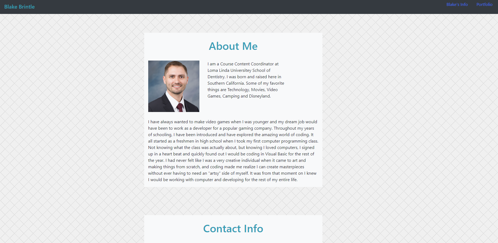
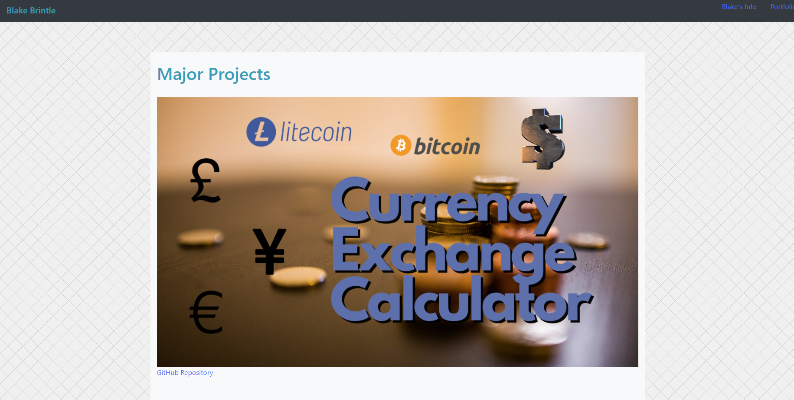

# Blake Brintle's Portfolio

Root folder contains:

* README.md      (Read Me File)
* index.html     (About Me Page)
* contact.html   (Contact Page)
* portfolio.html (Portfolio Page)
* \Assets\       (CSS and Images Folder)
*   \Images\    (Folder all Images for every site is held)
*   \css\       (folder where CSS file is held)

## Description
This is the main web page for Blake Brintle. You will find a quick "About Me" section along with all of Blake's contact information. You will also find some of the major projects Blake has worked on during his time in the UCR Coding Bootcamp course.

## Visuals
<a href="https://bbrintle.github.io/">Visit Site</a>
 

## Resources Used
HTML/CSS
 
<a href="https://getbootstrap.com/">Bootstrap (Framework)</a>

## Authors
This was created by Blake Brintle. 
 
blakebrintle@gmail.com
 
<a href="https://bbrintle.github.io/">Blake's Site</a>

## License
* MIT

- - -